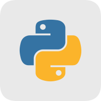

<div align="center">

<p align="center"> </p>

# Hello Python
<p align="center"> 
 </p>

Python 语言知识体系 · [在线阅读](https://cuihairu.github.io/hello-python/)

</div>

---

从语法入门到工程实战的 Python 知识站点，覆盖数据结构、面向对象、并发编程、标准库、测试与打包发布。

## 本地开发

```bash
npm install          # 安装依赖
npm run docs:dev     # 本地开发
npm run docs:build   # 构建到 docs/.vitepress/dist
npm run docs:preview # 本地预览构建产物
```

## 目录结构

```text
docs/
├── basics/          # 入门：环境、语法、类型、控制流、函数
├── datastructures/  # 数据结构：列表、字典、字符串、迭代器
├── advanced/        # 进阶：OOP、魔法方法、装饰器、类型注解
├── concurrency/     # 并发：threading、asyncio、multiprocessing
├── engineering/     # 工程：标准库、测试、日志、打包
├── internals/       # 源码解析：CPython 源码走读（带文件行号引用）
└── .vitepress/      # VitePress 配置与主题
```

## License

本作品采用 [Creative Commons Attribution 4.0 International (CC BY 4.0)](https://creativecommons.org/licenses/by/4.0/) 许可协议发布。